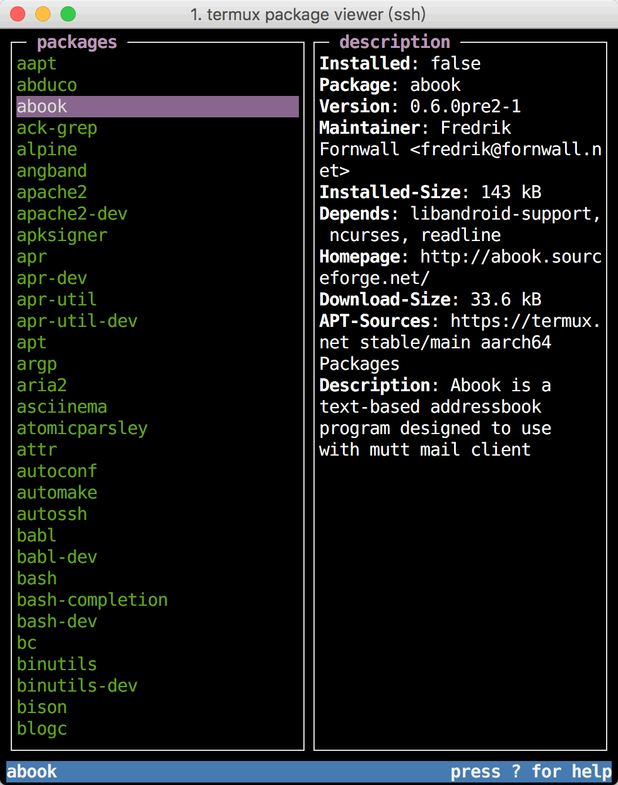

# termux-pkg-viewer

**NEW:** To make it easier to use, I wrote a VIM script to do the same thing.
```vim
let s:currentPkgName = ""
let s:lastJob = 0
let s:isJobPending = v:false
let s:bufferId = 0

function! s:UpdateInfo(text)
    if s:bufferId == 0
        rightbelow vnew
        let s:bufferId = winbufnr(".")
        setlocal buftype=nofile
        setlocal bufhidden=hide
        setlocal noswapfile
    endif
    wincmd l
    call deletebufline(s:bufferId, 1, "$")
    call appendbufline(s:bufferId, 0, a:text)
    wincmd h
endfunction


function! s:ReadChannelData(channel)
    let l:buffer = []
    while ch_status(a:channel, {'part': 'out'}) == 'buffered'
        call add(l:buffer, ch_read(a:channel))
    endwhile
    call s:UpdateInfo(l:buffer)
    let s:isJobPending = v:false
endfunction


function! s:ShowPkgInfo()
    let l:text = getline(".")
    let l:parts = split(l:text, "/")
    if len(l:parts) < 2
        return
    endif
    let l:name = l:parts[0]
    if l:name == s:currentPkgName
        return
    endif
    let s:currentPkgName = l:name
    if s:isJobPending
        call job_stop(s:lastJob)
    endif
    let s:lastJob = job_start(["apt", "show", l:name], {"close_cb": function("<SID>ReadChannelData")})
    let s:isJobPending = v:true
endfunction
" usage:
"   pkg list-all > termux.pkg
"   vim termux.pkg
autocmd CursorMoved *.pkg call s:ShowPkgInfo()

```

Don't know termux yet? See [here](https://termux.com/) and [here](https://github.com/termux/termux-app) and [here](https://github.com/termux/termux-packages)

I wrote this tool to make it more convenient for myself to play termux. I used nodejs and [blessed](https://github.com/chjj/blessed) to develop this tool. The following is a screenshot. Welcome to use this tool, and if you have a better idea, just open a new issue😀.



## Features

* Arbitrary install, uninstall termux package

* easy to see the instructions for each package

## Installation

1. install `nodejs`
```bash
pkg install nodejs
```

2. clone this project
```bash
git clone https://github.com/mystorp/termux-pkg-viewer.git
```

3. run
```
cd termux-pkg-viewer
npm start
```
